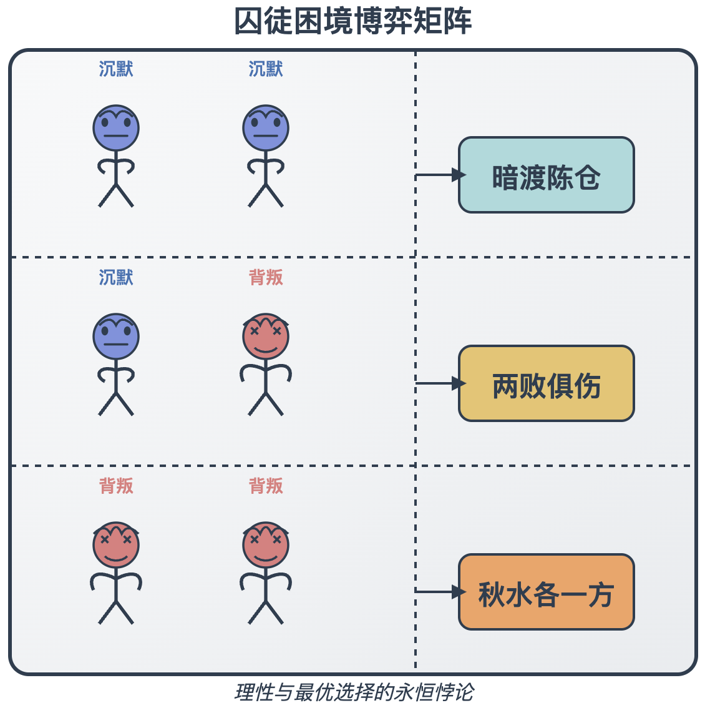

<h1 align="center">FinGenius - 首个A股博弈多智能体应用</h1>

<div align="center">

</div>

<p align="center">


<a href="https://fingenius.cn"></a>
</p>

## 项目简介

**FinGenius 是全球首个A股AI金融未来博弈多智能体应用**，不是技术工程师一拍脑袋的产物，而是**扎根A股1700多天的市场真实观察，不断推翻100多个app版本**，打造出的一个完全颠覆于传统，极简体现agent独有特色的产品。

目前开源了一个AI金融分析平台，采用 **Research–Battle 双子星环境多智能体架构**，在大语言模型与专业金融工具（基于 MCP 协议）的基础上，共训练构建了16 个超级智能体分工协作，目前开源出6个 （舆情、游资、风控、技术、筹码、大单异动等Agents）
- 舆情agent算因子
- **游资**agent帮你读龙虎榜
- 风控agent扒政策
- 技术agent盯持仓红线
- 筹码agent识别主力行为
- **大单异动**agent监控实时市场动向

几分钟就汇总成报告通过6位专业AI分析师的协作研究与结构化**多轮辩论博弈的HTML报告**。

常见通用大模型，和**不完全立足于A股研究的项目**，回答**很容易 “说胡话”**，A股专业领域的 **“幻觉” 能坑哭散户**；
记不住 “老熟人”，每次打开都像初见，你上周问过的政策解读、持仓记录，它早忘到脑后；
尤其对 A 股用户，现在市面的AI金融项目要么**照搬美股逻辑水土不服**，要么让用户无法享受AI智能的便捷。
 
但 Figenius 是带着 “AI 脑子” 来的：
**它像个 “A股金融老中医”**：
- 会”对症使巧劲“下药
- 会”抽丝剥茧“捋病因
- 会记你的 “病史”

自主研发的 “年轮记忆规则算法”（app内嵌有，欢迎体验），不是简单存记录 —— 而是像树的年轮一样，记下你的投资习惯。


> 本项目仅供学习和研究，输出结果为AI推演，不构成任何投资建议。投资有风险，入市需谨慎。


这是FinGenius的核心创新：​


系统引入了博弈论的思想来优化决策过程。
如同经典的"囚徒困境"模型（两个囚犯被分别关押，警方劝说他们揭发对方——如果都选择沉默，都能轻判；只要有一人背叛，背叛者轻判，另一人重判），在信息不对称的环境中，各方参与者需要预测他人的行动来做出最优决策，就像复杂多变的A股市场。





## APP体验(目前开放8000位免费早鸟体验名额)

我们诚挚邀请您体验，团队6年的心血，FinGenius移动应用：

- 特色功能：史上第一款极简agentAI金融app，数学博弈魔法，直接给你最想看到的东西。革新A股体验场景。
- 移动应用：目前已上架荣耀、小米、Vivo应用市场（华为、Apple上架流程较长，正在审核中）
- 免费早鸟体验名额：扫码关注FinGenius服务号，限量前8000位。
  


**FinGenius俱乐部**

欢迎对AI金融极致热爱的你

携手完善[FinGenius](https://fingenius.cn)，共同探索金融智能分析的技术前沿边界！🌟


## 安装指南

我们提供两种安装方式。推荐使用方式二（uv），因为它能提供更快的安装速度和更好的依赖管理。

### 方式一：使用 conda

1. 创建新的 conda 环境：

   ```bash
   conda create -n fingenius python=3.12
   conda activate fingenius
   ```

2. 克隆仓库：

   ```bash
   git clone https://github.com/huayaoyuanjin/FinGenius.git
   cd FinGenius
   ```

3. 安装依赖：

   ```bash
   pip install -r requirements.txt
   ```

### 方式二：使用 uv（推荐）

1. 安装 uv（一个快速的 Python 包管理器）：

   ```bash
   curl -LsSf https://astral.sh/uv/install.sh | sh
   ```

2. 克隆仓库：

   ```bash
   git clone https://github.com/huayaoyuanjin/FinGenius.git
   cd FinGenius
   ```

3. 创建并激活虚拟环境：

   ```bash
   uv venv --python 3.12
   source .venv/bin/activate  # Unix/macOS 系统
   # Windows 系统使用：
   # .venv\Scripts\activate
   ```

4. 安装依赖：

   ```bash
   uv pip install -r requirements.txt
   ```

## 配置说明

FinGenius 需要配置使用的 LLM API，请按以下步骤设置：

1. 在 `config` 目录创建 `config.toml` 文件（可从示例复制）：

   ```bash
   cp config/config.example.toml config/config.toml
   ```

2. 编辑 `config/config.toml` 添加 API 密钥和自定义设置：

   ```toml
   # 全局 LLM 配置
   [llm]
   model = "gpt-4o"
   base_url = "https://api.openai.com/v1"
   api_key = "sk-..."  # 替换为真实 API 密钥
   max_tokens = 4096
   temperature = 0.0

   # 可选特定 LLM 模型配置
   [llm.vision]
   model = "gpt-4o"
   base_url = "https://api.openai.com/v1"
   api_key = "sk-..."  # 替换为真实 API 密钥
   ```

## 使用方法

一行命令运行 FinGenius：

```bash
python main.py 股票代码
```

### 使用示例

```bash
# 基础分析
python main.py 000001

# 启用文本转语音
python main.py 000001 --tts

# 设置3轮辩论
python main.py 000001 --debate-rounds 3

# 自定义输出格式并保存到文件
python main.py 000001 --format json --output analysis_report.json
```

### 可选参数

- `-f, --format` - 输出格式（text 或 json）
- `-o, --output` - 将结果保存到文件
- `--tts` - 启用文本转语音播报最终结果
- `--max-steps` - 每个智能体的最大步数（默认: 3）
- `--debate-rounds` - Battle环境辩论轮数（默认: 2）

## 项目结构

FinGenius 的系统架构以分层解耦与模块化协同为核心，通过明确的接口规范，构建了一个既健壮稳定又易于扩展的智能分析平台。

**核心特性：**
- **Research环境**：多智能体协作深度分析，6位专业AI分析师并行/顺序分析（可配置）
- **Battle环境**：结构化多轮辩论系统，支持可配置轮数的顺序发言和投票决策
- **完整上下文传递**：Research所有分析结果完整传递给Battle环境的每位专家
- **累积辩论机制**：每位发言者都能获得前面所有专家的观点，形成递进式深度讨论
- **状态保持**：确保分析链路的完整性和上下文连贯性

为更直观地展示其内部结构与运作逻辑，以下类图和流程图分别从静态类组织和动态执行流程两个维度进行呈现。

### 类图

```mermaid
classDiagram
    %%==========================
    %% 1. Agent 层次结构
    %%==========================
    class BaseAgent {
        <<abstract>>
        - name: str
        - description: Optional[str]
        - system_prompt: Optional[str]
        - next_step_prompt: Optional[str]
        - llm: LLM
        - memory: Memory
        - state: AgentState
        - max_steps: int
        - current_step: int
        + run(request: Optional[str]) str
        + step() str <<abstract>>
        + update_memory(role, content, **kwargs) None
        + reset_execution_state() None
    }
    class ReActAgent {
        <<abstract>>
        + think() bool <<abstract>>
        + act() str <<abstract>>
        + step() str
    }
    class ToolCallAgent {
        - available_tools: ToolCollection
        - tool_choices: ToolChoice
        - tool_calls: List~ToolCall~
        + think() bool
        + act() str
        + execute_tool(command: ToolCall) str
        + cleanup() None
    }
    class MCPAgent {
        - mcp_clients: MCPClients
        - tool_schemas: Dict~str, dict~
        - connected_servers: Dict~str, str~
        - initialized: bool
        + create(...) MCPAgent
        + initialize_mcp_servers() None
        + connect_mcp_server(url, server_id) None
        + initialize(...) None
        + _refresh_tools() Tuple~List~str~,List~str~~
        + cleanup() None
    }
    class SentimentAgent {
        <<extends MCPAgent>>
    }
    class RiskControlAgent {
        <<extends MCPAgent>>
    }
    class HotMoneyAgent {
        <<extends MCPAgent>>
    }
    class TechnicalAnalysisAgent {
        <<extends MCPAgent>>
    }
    class ReportAgent {
        <<extends MCPAgent>>
    }

    %% 继承关系
    BaseAgent <|-- ReActAgent
    ReActAgent <|-- ToolCallAgent
    ToolCallAgent <|-- MCPAgent
    MCPAgent <|-- SentimentAgent
    MCPAgent <|-- RiskControlAgent
    MCPAgent <|-- HotMoneyAgent
    MCPAgent <|-- TechnicalAnalysisAgent
    MCPAgent <|-- ReportAgent

    %% 组合关系
    BaseAgent *-- LLM               : llm
    BaseAgent *-- Memory            : memory
    MCPAgent *-- MCPClients         : mcp_clients

    %%==========================
    %% 2. 环境（Environment）架构
    %%==========================
    class BaseEnvironment {
        <<abstract>>
        - name: str
        - description: str
        - agents: Dict~str, BaseAgent~
        - max_steps: int
        + create(...) BaseEnvironment
        + register_agent(agent: BaseAgent) None
        + run(...) Dict~str,Any~ <<abstract>>
        + cleanup() None
    }
    class ResearchEnvironment {
        - analysis_mapping: Dict~str,str~
        - results: Dict~str,Any~
        + initialize() None
        + run(stock_code: str) Dict~str,Any~
        + cleanup() None
    }
    class BattleState {
        - active_agents: Dict~str,str~
        - voted_agents: Dict~str,str~
        - terminated_agents: Dict~str,bool~
        - battle_history: List~Dict~str,Any~~
        - vote_results: Dict~str,int~
        - battle_highlights: List~Dict~str,Any~~
        - battle_over: bool
        - agent_order: List~str~
        - debate_history: List~Dict~str,Any~~
        - current_round: int
        - current_speaker_index: int
        + add_event(type, agent_id, ...) Dict~str,Any~
        + record_vote(agent_id,vote) None
        + mark_terminated(agent_id,reason) None
    }
    class BattleEnvironment {
        - state: BattleState
        - debate_rounds: int
        - tools: Dict~str,BaseTool~
        + initialize() None
        + register_agent(agent: BaseAgent) None
        + run(report: Dict~str,Any~) Dict~str,Any~
        + handle_speak(agent_id, content) ToolResult
        + handle_vote(agent_id, vote) ToolResult
        + _run_structured_debate() None
        + _build_debate_context(agent_id) str
        + _broadcast_speech(agent_id, content) None
        + _run_final_voting() None
        + cleanup() None
    }
    class EnvironmentFactory {
        + create_environment(env_type: EnvironmentType, agents, ...) BaseEnvironment
    }

    %% 继承与工厂
    BaseEnvironment <|-- ResearchEnvironment
    BaseEnvironment <|-- BattleEnvironment
    EnvironmentFactory ..> BaseEnvironment : creates
    %% 环境中包含 Agents 和 BattleState
    BaseEnvironment o-- BaseAgent      : agents
    BattleEnvironment *-- BattleState  : state

    %%==========================
    %% 3. 工具（Tool）抽象
    %%==========================
    class MCPClients {
        - sessions: Dict~str,ClientSession~
        - exit_stacks: Dict~str,AsyncExitStack~
        + connect_sse(url, server_id) None
        + connect_stdio(cmd, args, server_id) None
        + list_tools() ListToolsResult
        + disconnect(server_id) None
    }

    %%==========================
    %% 4. 支持类
    %%==========================
    class Memory {
        - messages: List~Message~
        + add_message(msg: Message) None
        + clear() None
    }
    class LLM {
        - model: str
        - max_tokens: int
        - temperature: float
        + ask(messages, system_msgs, ...) str
        + ask_tool(messages, tools, tool_choice, ...) Message
    }
```

### 流程图
```mermaid
sequenceDiagram
    %% FinGenius 双环境执行流程（Research-Battle）
    participant User
    participant Main
    participant Env as Environment
    participant Agents as Agent Team
    participant Tool

    %% 用户发起股票研究
    User->>Main: run(stock_code)
    Main->>Env: create Research & run(stock_code)

    %% 研究阶段：Agent Team 循环分析并调用工具
    Env->>Agents: analyze(stock_code)
    loop 分析循环
        Agents->>Agents: step()/think()/act()
        Agents->>Tool: call tool
        Tool-->>Agents: 返回结果
    end
    Agents-->>Env: analysis result
    Env-->>Main: research results

    %% 博弈阶段：Agent Team 保持研究状态进行结构化辩论
    Main->>Env: run battle with research results
    Env->>Agents: 传递完整研究分析结果（所有6位专家的详细分析）
    loop 多轮辩论循环 (默认2轮)
        loop 单轮发言 (按顺序)
            Note over Env,Agents: 累积上下文传递：当前发言者获得<br/>研究结果+前面所有发言者观点
            Env->>Agents: 发送累积辩论上下文
            Agents->>Agents: step()/think()/act()
            Agents->>Tool: call battle tool
            Tool-->>Agents: 返回结果
            Agents-->>Env: 发言内容
            Env->>Agents: 广播发言给其他智能体
        end
    end
    Env->>Agents: 进行最终投票
    Agents-->>Env: 投票结果
    Env-->>Main: 辩论结果和最终决策

    %% 输出最终结果
    Main-->>User: 显示研究报告和辩论结果
```

## 许可证

FinGenius 使用 [GPL v3 许可证](LICENSE)。

## 致谢

本项目基于 OpenManus 多智能体框架开发，继承了其"工具即能力"的核心理念，并将其扩展到金融分析领域，打造出专业化的金融智能体团队。

感谢 [OpenManus](https://github.com/mannaandpoem/OpenManus) 项目的启发与支持。

特别感谢 [JayTing511](https://github.com/JayTing511) 对本项目的支持与帮助。

项目顾问：[mannaandpoem](https://github.com/mannaandpoem)

我们诚邀所有AI和金融领域的开发者与研究者加入FinGenius开源社区！

> ⚠️ 免责声明：本项目仅用于教育和研究目的，专注于金融分析技术的探索，不提供投资预测或决策建议。
> ⚠️ 追责声明：本项目基于GPLv3协议开发，禁止项目代码及框架闭源商用，协议存在法律效力，保留追责权利。
