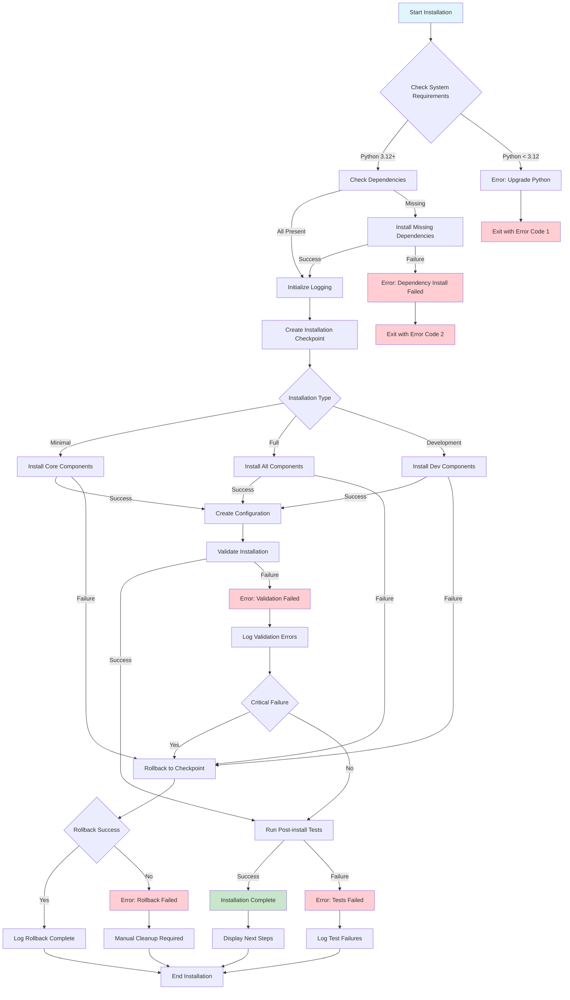

# Improved Installation Process Flow

## Overview
This diagram shows the enhanced installation process with improved error handling, logging, and recovery mechanisms.

## Key Improvements Visualized

1. **Enhanced Error Handling**: Multiple error paths with specific error codes
2. **Checkpoint System**: Recovery points for failed installations
3. **Rollback Mechanism**: Automatic rollback on failures
4. **Installation Types**: Support for different installation variants
5. **Validation Steps**: Post-installation verification
6. **Comprehensive Logging**: All steps logged for troubleshooting